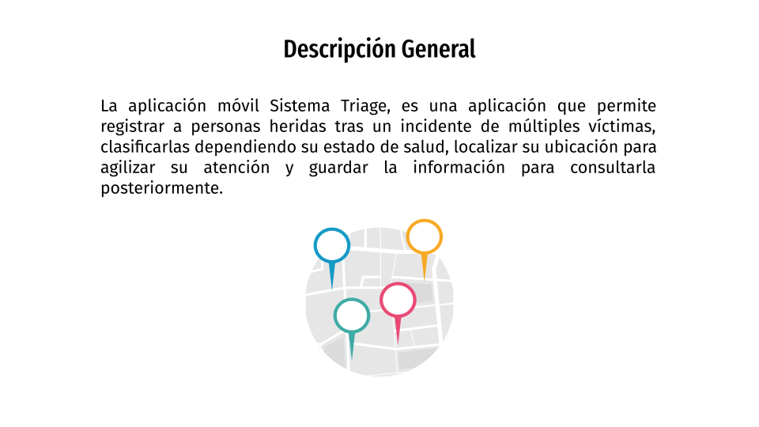
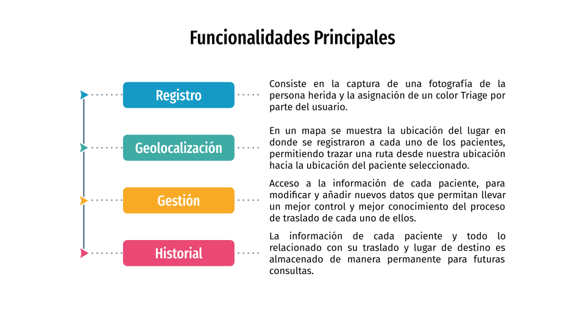
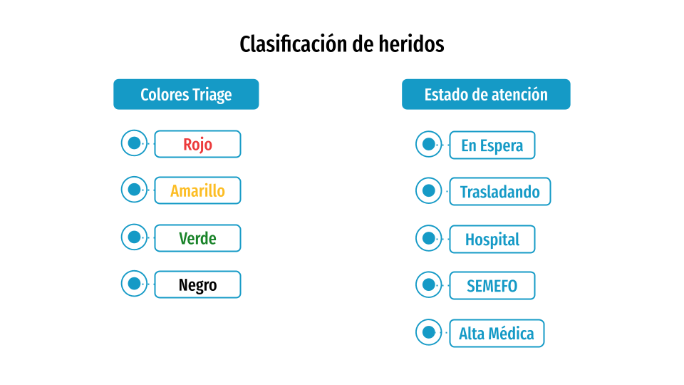
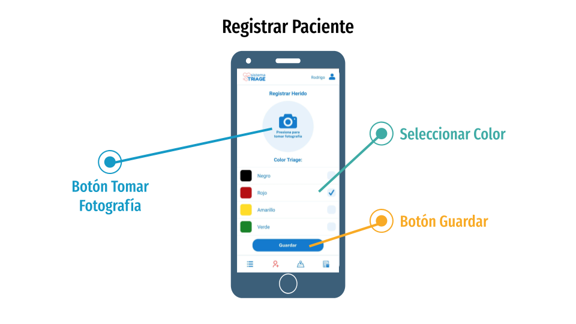
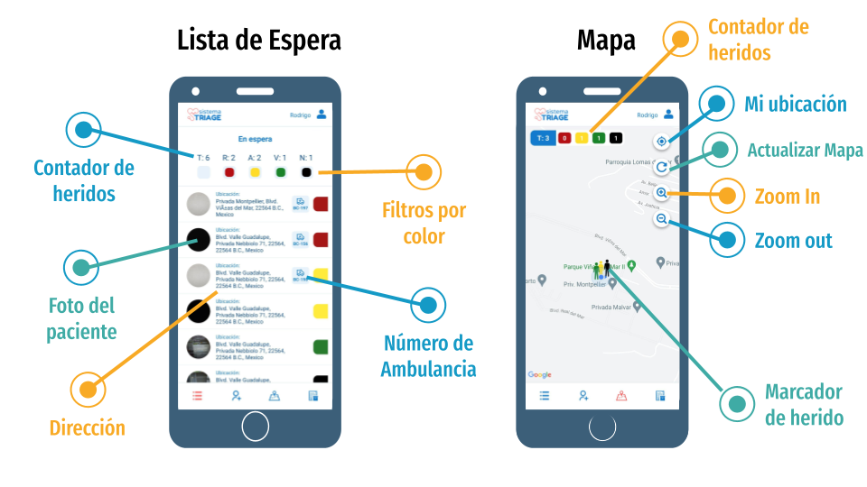
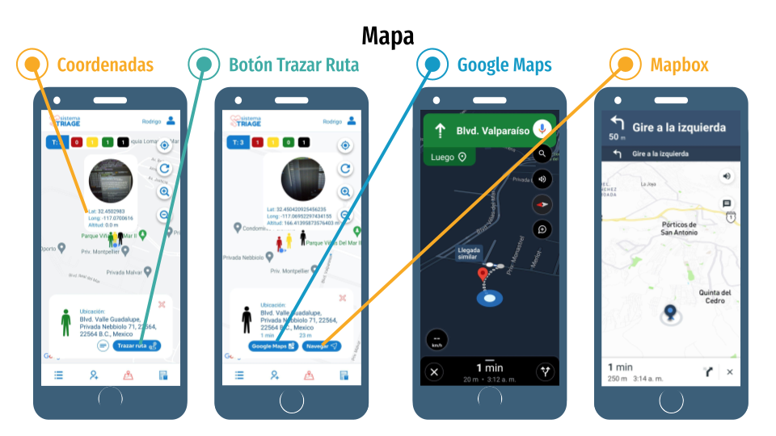
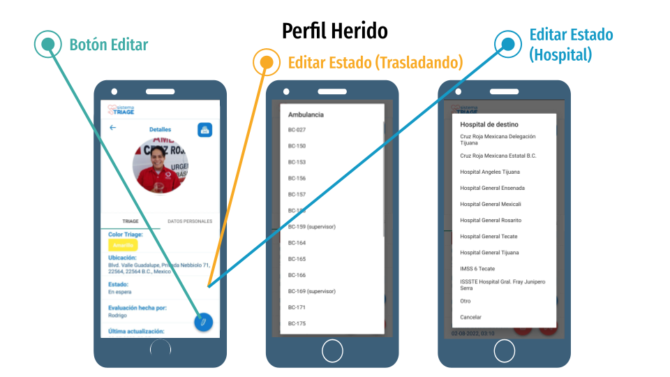
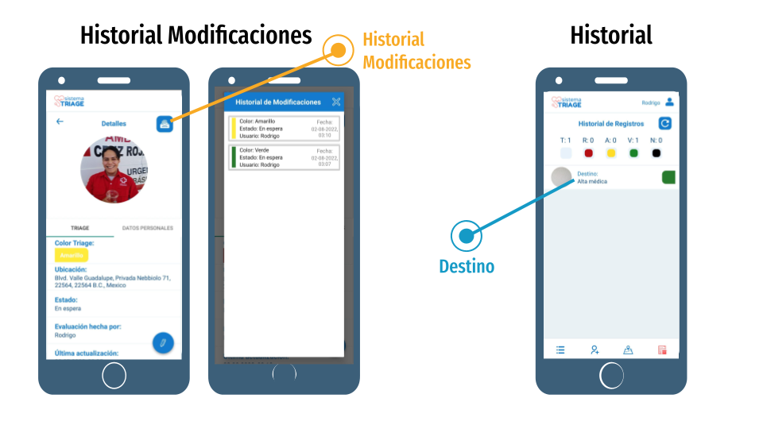

# sistemaTriage

- Lea el archivo Manual Técnico.pdf para conocer más sobre sobre las herramientas utilizadas y algunas secciones del proyecto.

- El archivo Dump20220912.sql es la base de datos, la cual se debe descargar e importar en el SGBD (MySQL Workbench).

- Los archivos php para las consultas a la base de datos desde el servidor se encuentran en la carpeta php.

